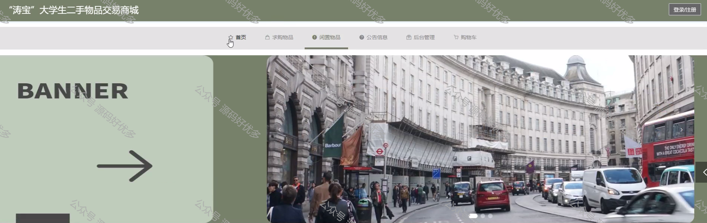
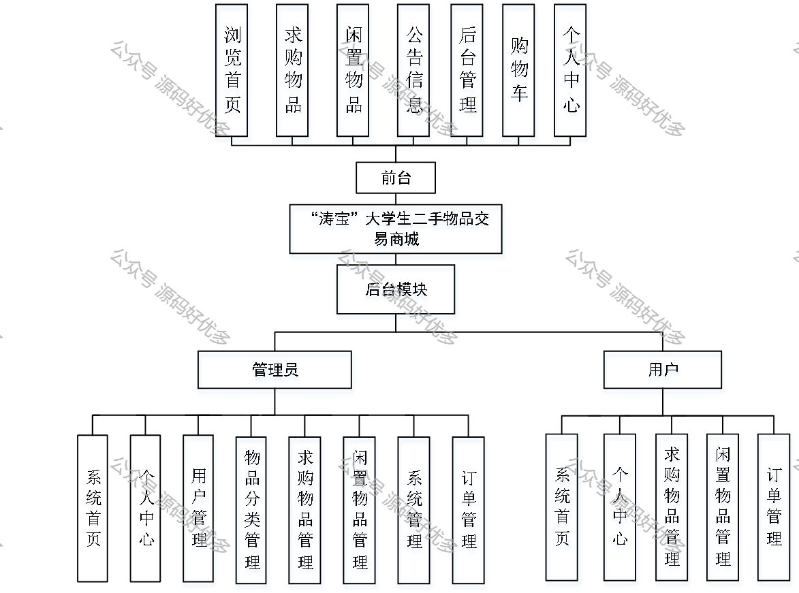
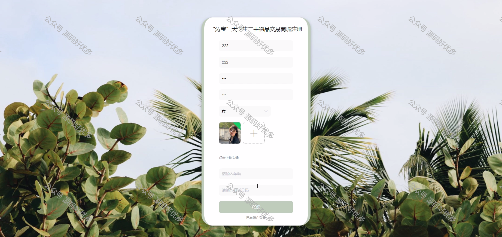
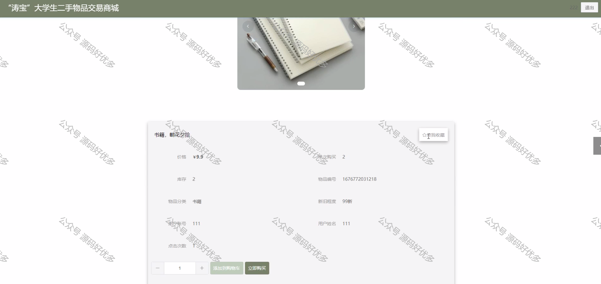
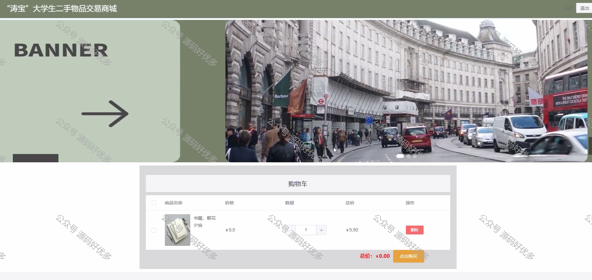
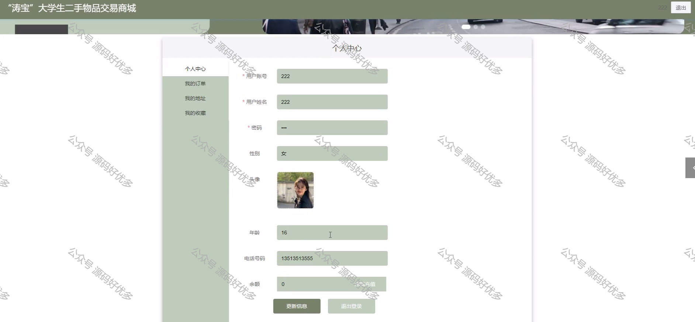
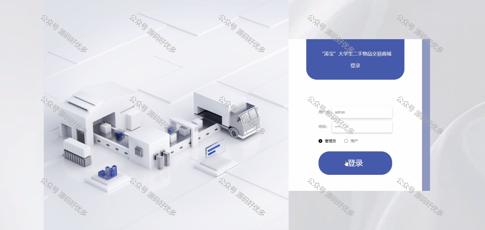
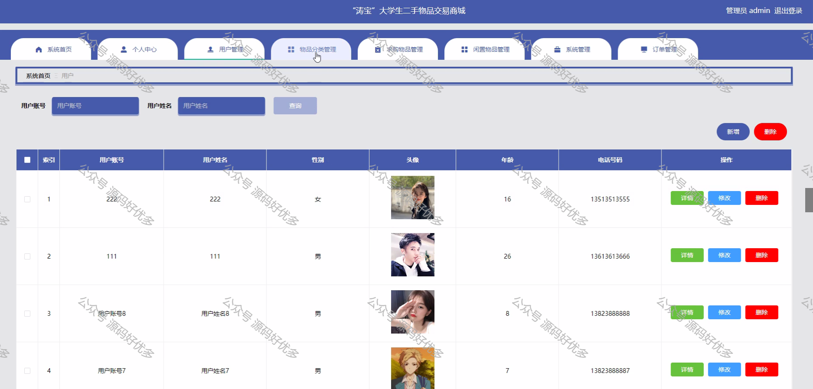
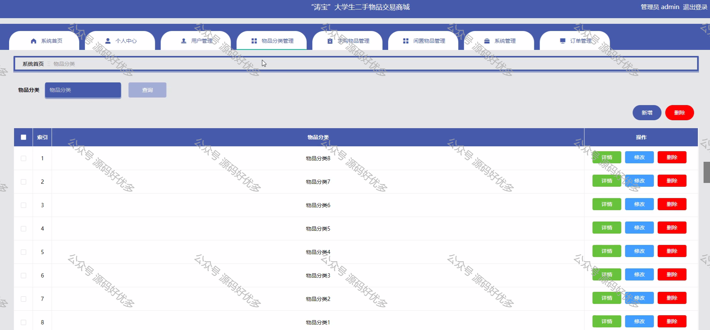
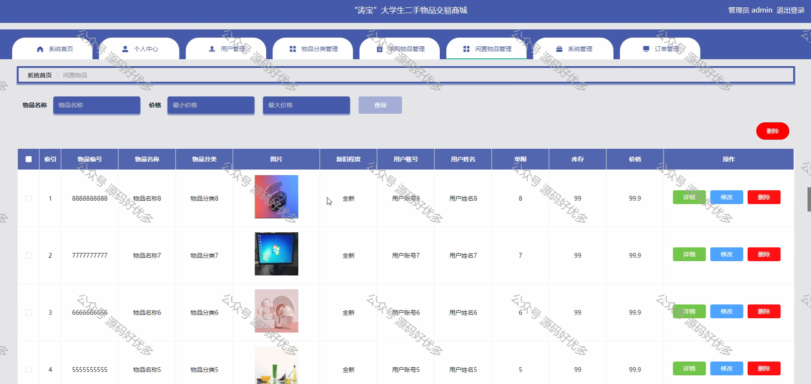

 
## 查看主页获取源码

> **作者介绍**： **✌**全网粉丝10W+本平台特邀作者、博客专家、CSDN新星计划导师、java领域优质创作者,博客之星、掘金/华为云/阿里云/InfoQ等平台优质作者、专注于毕业项目实战 **✌**

  

### 一、作品包含

源码+数据库+全套环境和工具资源+部署教程

### 二、项目技术

前端技术：Html、Css、Js、LayUI

数据库：MySQL

后端技术：Java、Spring Boot、MyBatis

  

### 三、运行环境

开发工具：IDEA

数据库：MySQL8.0

数据库管理工具：Navicat10以上版本

环境配置软件： JDK1.8+Maven3.6.3

  

### 四、项目介绍

项目编号：springbootA028

仓库管理系统总共分为两个大的模块，分别是系统模块和业务模块。其中系统模块和业务模块底下又有其子模块。
功能模块
一、业务模块
1、客户管理
客户列表
客户分页和模糊查询
客户添加、修改、删除、批量删除
2、供应商管理
供应商列表
供应商分页和模糊查询
供应商添加、修改、删除、批量删除
3、商品管理
商品列表
商品分页和模糊查询
商品添加、修改、删除、商品图片的上传
4、商品进货管理
商品进货列表
商品进货分页和模糊查询
商品进货添加、修改、删除、商品退货
5、商品退货管理
商品退货列表
商品退货分页和模糊查询
商品退货删除
6、商品销售管理
商品销售列表
商品销售分页和模糊查询
商品销售添加、修改、删除、商品销售退货
7、商品销售退货管理
商品销售退货列表
商品销售退货分页和模糊查询
商品销售退货删除
二、系统模块
1、用户登陆
校验用户名、密码以及验证码
登陆成功将登陆信息写入登陆日志
未登录直接访问服务器资源进行拦截
2、菜单管理
全查询菜单和根据左边的树查询不同菜单
菜单的添加、修改、删除
3、角色管理
全查询角色和模糊查询
角色的添加、修改、删除以及给角色分配权限
4、用户管理
全查询用户和模糊查询
用户的添加、修改、删除、重置密码以及给用户分配角色
5、部门管理
全查询部门、模糊查询以及根据左边的树查询不同的部门
部门的添加、修改、删除

### 五、运行截图

  
